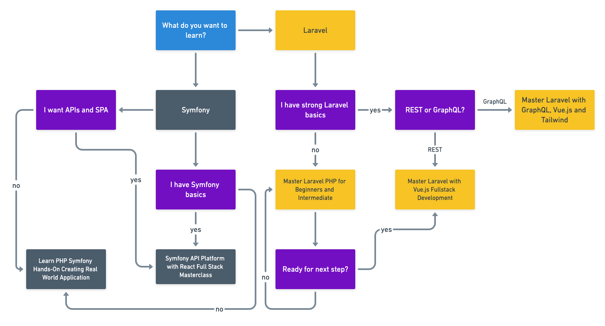

# Piotr Jura

## Hi 👋

I'm Piotr Jura, Udemy Instructor.

🔭 You can find the source code of my Udemy courses here and other stuff you might find interesting or useful if you're into PHP/Symfony/Laravel/Vue/React or web development in general.

## Udemy Courses :school:

Click on course name to grab it.

### [Master Laravel with GraphQL, Vue.js and Tailwind](https://www.udemy.com/course/master-laravel-with-graphql-vuejs-and-tailwind/?referralCode=CE3B5297B3614EFA884A)

In this course you'll learn the basics of using Laravel together with Vue.js and Lighthouse to create a SPA backed by GraphQL server.
You'll create 2 apps, the simple blog platform and a Trello clone.

#### Source code is available:

[BlogQL Source Code](https://github.com/piotr-jura-udemy/laravel-graphql-vue-tailwind-course)

[Laravello Source Code - a Trello clone in Vue & Laravel](https://github.com/piotr-jura-udemy/laravel-graphql-course-trello-clone)

### [Master Laravel with Vue.js Fullstack Development](https://www.udemy.com/course/master-laravel-6-with-vuejs-fullstack-development/?couponCode=GITHUB)

Learn Vue.js - simplest yet very powerful of the JS frameworks out there. Build a simple booking app, a SPA - like booking.com/AirBnb.

[Course Source Code](https://github.com/piotr-jura-udemy/laravel-vue-spa-course)

### [Master Laravel PHP for Beginners and Intermediate](https://www.udemy.com/course/laravel-beginner-fundamentals/?couponCode=GITHUB)

Laravel fundamentals and masterclass course. Covers almost everything the framework has to offer.

[Course Source Code](https://github.com/piotr-jura-udemy/laravel-course)

## In what order should I take your courses? :rowboat:

Click to open bigger image

## Eductional material :green_book:

### [Laravel cheat-sheet](https://github.com/piotr-jura-udemy/laravel-cheat-sheet)

A Laravel Cheat Sheet - simple collection of additional Laravel explanations helpful when taking the course, but also for everyone else not enrolled. A little bit of shortcuts, code chunks, tables and diagrams.
